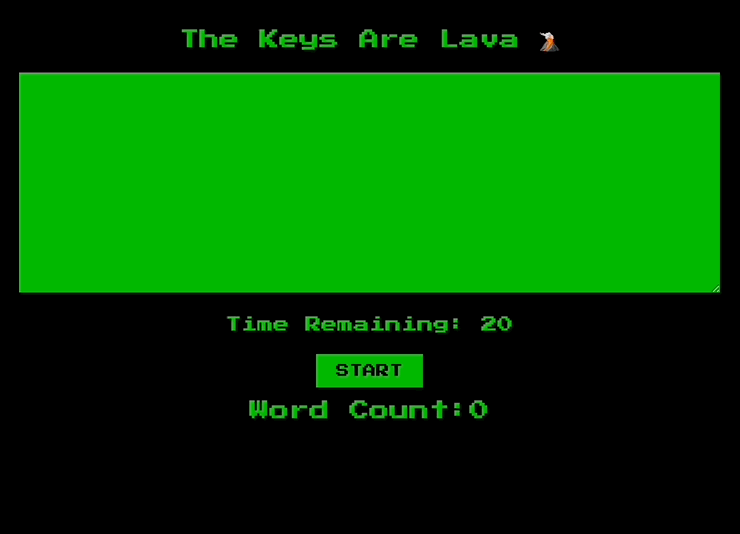

To run the code:

In your terminal: $ git clone https://github.com/eebrownl/speed_typing_game.git

cd into the folder and install project's dependencies: $ npm install

Run the project: $ npm start

